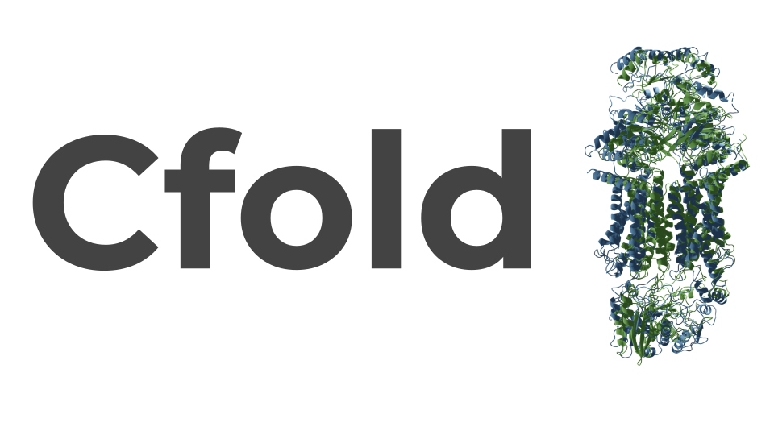

# Cfold

**Structure prediction of alternative protein conformations**




\
Cfold is a structure prediction network similar to AlphaFold2 that is trained on a conformational split of the PDB. Cfold is designed for predicting alternative conformations of protein structures. Read more about it [here](https://www.biorxiv.org/content/10.1101/2023.09.25.559256v1)
\
\
AlphaFold2 is available under the [Apache License, Version 2.0](http://www.apache.org/licenses/LICENSE-2.0) and so is Cfold, which is a derivative thereof. The Cfold parameters are made available under the terms of the [CC BY 4.0 license](https://creativecommons.org/licenses/by/4.0/legalcode).
\
\
**You may not use these files except in compliance with the licenses.**

# Colab (run in the web)

[Colab Notebook](https://colab.research.google.com/github/patrickbryant1/Cfold/blob/master/Cfold.ipynb)

# Local installation

## Python packages
* For the python environment, we recommend to install it with pip as described below. \
You can do this in your virtual environment of choice.

```
pip install -U jaxlib==0.3.24+cuda11.cudnn82 -f https://storage.googleapis.com/jax-releases/jax_cuda_releases.html
pip install jax==0.3.24
pip install ml-collections==0.1.1
pip install dm-haiku==0.0.9
pip install pandas==1.3.5
pip install biopython==1.81
pip install chex==0.1.5
pip install dm-tree==0.1.8
pip install immutabledict==2.0.0
pip install numpy==1.21.6
pip install scipy==1.7.3
pip install tensorflow==2.11.0
pip install optax==0.1.4
```

## Get network parameters for Cfold

```
wget https://gitlab.com/patrickbryant1/cfold_data/-/raw/main/params10000.npy
```

## Uniclust30

```
wget http://wwwuser.gwdg.de/~compbiol/uniclust/2018_08/uniclust30_2018_08_hhsuite.tar.gz --no-check-certificate
mkdir data/uniclust30
mv uniclust30_2018_08_hhsuite.tar.gz data/uniclust30
tar -zxvf data/uniclust30/uniclust30_2018_08_hhsuite.tar.gz
```

## HHblits
```
git clone https://github.com/soedinglab/hh-suite.git
mkdir -p hh-suite/build && cd hh-suite/build
cmake -DCMAKE_INSTALL_PREFIX=. ..
make -j 4 && make install
cd ..
```

# Run the test case

## Search Uniclust30 with HHblits to generate an MSA
```
ID=4AVA
FASTA_DIR=./data/test/
UNICLUST=./data/uniclust30_2018_08/uniclust30_2018_08
OUTDIR=./data/test/

./hh-suite/build/bin/hhblits -i $FASTA_DIR/$ID.fasta -d $UNICLUST -E 0.001 -all -oa3m $OUTDIR/$ID'.a3m'
```

## MSA feats
```
MSA_DIR=./data/test/
OUTDIR=./data/test/

python3 ./src/make_msa_seq_feats.py --input_fasta_path $FASTA_DIR/$ID'.fasta' \
--input_msas $MSA_DIR/$ID'.a3m' --outdir $OUTDIR
```

## Predict
```
FEATURE_DIR=./data/test/
PARAMS=./params10000.npy
OUTDIR=./data/test/

NUM_REC=3 #Increase for hard targets
NUM_SAMPLES=13 #Increase for hard targets

python3 ./src/net/predict_with_clusters.py --feature_dir $FEATURE_DIR \
--predict_id $ID \
--ckpt_params $PARAMS \
--num_recycles $NUM_REC \
--num_samples_per_cluster $NUM_SAMPLES \
--outdir $OUTDIR/
```
